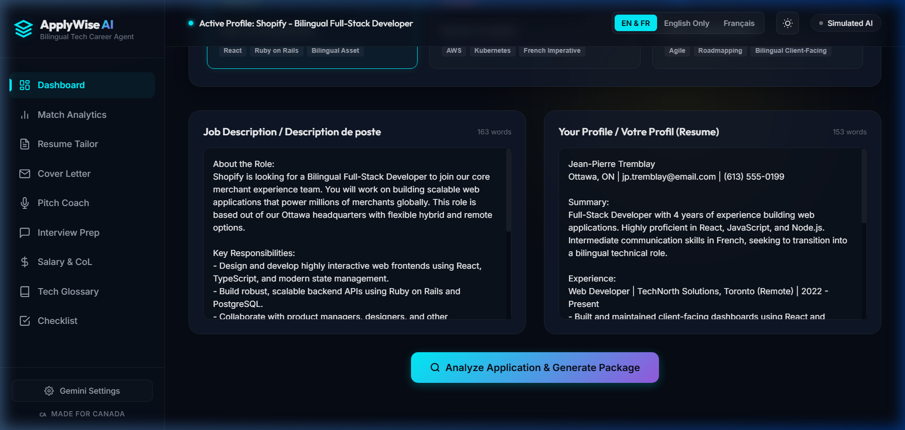
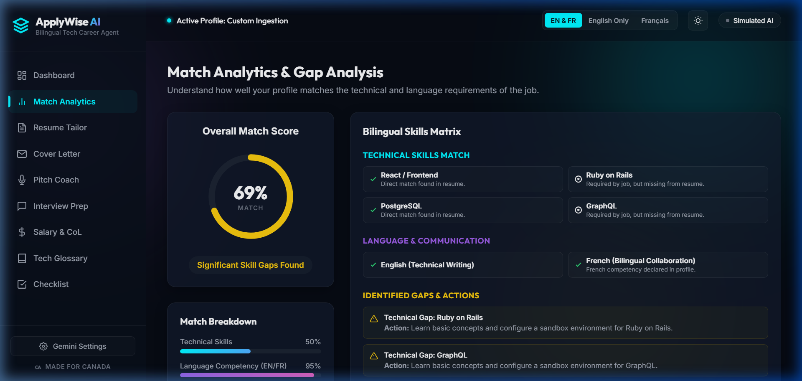
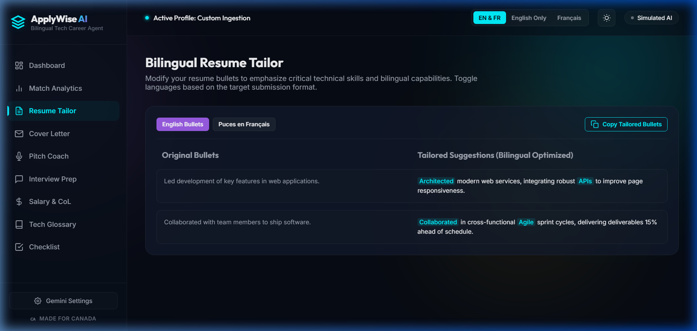
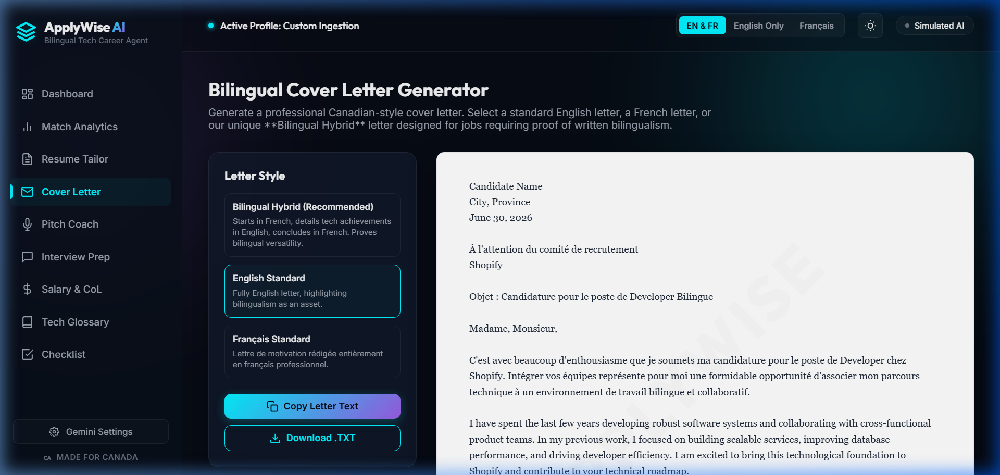
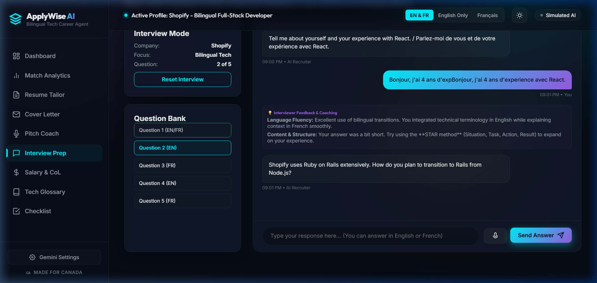
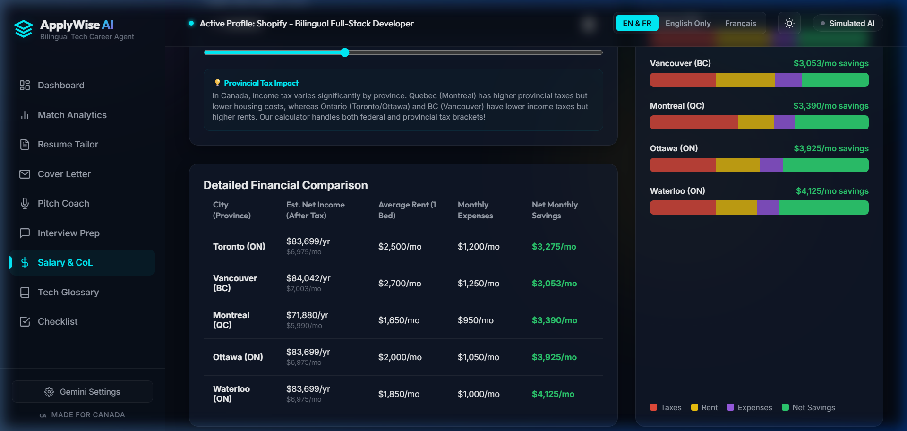
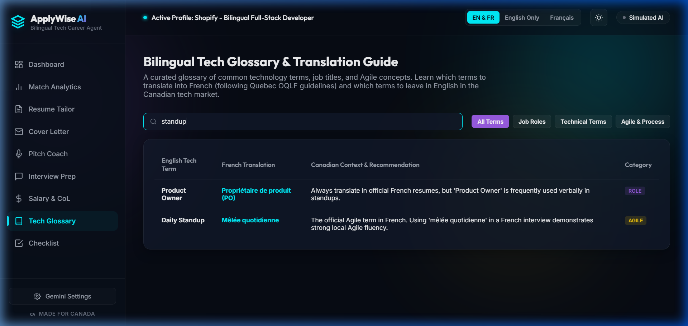
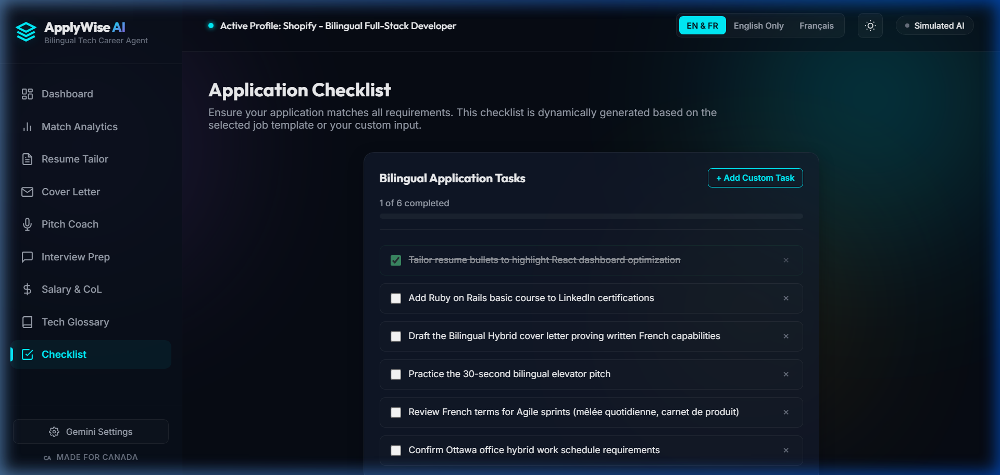

# ApplyWise AI 🇨🇦
### Bilingual Career Agent for Canadian Tech Jobs

ApplyWise AI is a premium, interactive web application designed to help bilingual (English/French) tech job seekers in Canada optimize their applications, analyze skill matches, tailor resumes, generate cover letters, practice elevator pitches, and run mock interviews.

---

## 📸 Application Showcases

### 1. The Dashboard & Profile Ingestion
Select from high-fidelity Canadian tech templates (Shopify, Coveo, RBC) or paste a custom Job Description and Resume.


### 2. Match Analytics & Gap Analysis
Get an overall match score, breakdown of technical, language, and experience competencies, and custom recommendations via the **Skill Gap Academy**.


### 3. Bilingual Resume Tailor
View side-by-side comparisons of original and tailored resume bullets. Hover to see highlighted technical keywords (Teal) and bilingual transition verbs (Purple).


### 4. Bilingual Cover Letter Builder
Generate standard English, standard French, or our unique **Bilingual Hybrid** cover letter that showcases dual-language writing capabilities in a single document.


### 5. Bilingual Interview Simulator
Practice technical and behavioral questions in a chatbot interface. The AI recruiter switches questions between English and French, providing inline coaching feedback.


### 6. Canadian Tech Hubs: Salary & Cost of Living
Enter your target base salary and instantly compare net income (after provincial and federal tax calculations), average rents, and monthly expenses in Toronto, Vancouver, Montreal, Ottawa, and Waterloo.


### 7. Bilingual Tech Glossary
A searchable database of technology terms and job titles, detailing when to translate terms (per Quebec OQLF guidelines) or leave them in English.


### 8. Dynamic Application Checklist
A dedicated todo manager that updates progress in real-time as tasks are completed.


---

## 🛠️ Tech Stack

- **Frontend**: HTML5, Vanilla JavaScript (ES6+)
- **Styling**: Vanilla CSS (CSS Grid, Flexbox, custom animations, glassmorphism, responsive design, dark/light themes)
- **API (Optional)**: Gemini API integration for live, real-time AI generation.

---

## 🚀 CI/CD Workflow & Live Deployment

This repository includes a GitHub Actions workflow under `.github/workflows/deploy.yml` that automatically deploys the application to **GitHub Pages** on every push to the `main` branch.

### How to Access the Live Site:
Once pushed, GitHub will host the site at:
`https://<your-github-username>.github.io/ApplyWise-AI/`

---

## 💻 Running Locally

### Prerequisites

- [Node.js](https://nodejs.org/) (for running the local development server)

### Steps

1. Start the local server:
   ```bash
   npm run dev
   ```
   *Or directly using npx:*
   ```bash
   npx http-server -p 3000
   ```
2. Open your browser and navigate to `http://localhost:3000`.

### Using Live Gemini AI (Optional)

1. Click on **Gemini Settings** in the bottom-left corner of the sidebar.
2. Enter your Gemini API Key (you can get one for free from [Google AI Studio](https://aistudio.google.com/)).
3. Select your preferred model (e.g., `gemini-2.5-flash`).
4. Click **Save & Connect**. The status indicator in the top-right will turn green (`Gemini Live`).
